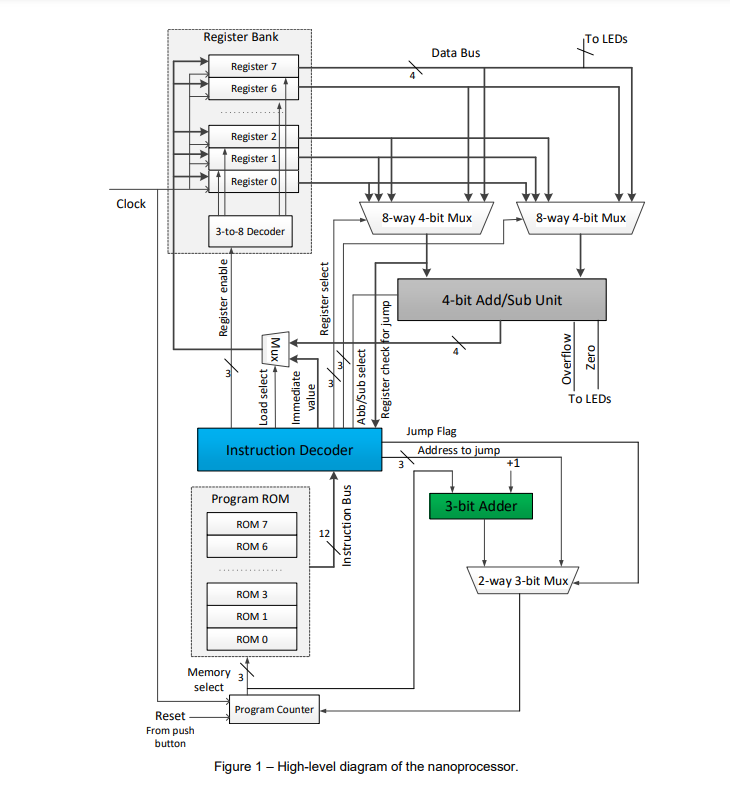

## Task
In this Project, we were tasked with designing a 4-bit processor capable of executing a set of instructions. To achieve this, we utilized and extended previously developed components, including:

- 4-bit Add/Subtract unit  
- 3-bit Adder  
- 3-bit Program Counter (PC)  
- k-way b-bit Multiplexers  
- Register Bank  
- Program ROM  
- Instruction Decoder  
- 7-Segment Display  
- Slow Clock
  

This group project involved distributing workload among team members, designing components, and refining them to ensure functionality. The processor was successfully implemented and tested on the Basys3 board.

---
## Introduction
This is a simple microprocessor capable of executing a simple set of instructions. In order to build the
microprocessor, we developed and extended the following components.
- 4-bit Add/Subtract unit - This unit have the ability to add and subtracting numbers represented using
2’s complement and this was built by modifying 4-bit RCA.
- 3-bit adder – This unit is used to increment the program counter. This was also built by modifying 4-bit
RCA.
- 3-bit Program Counter (PC) - Program Counter is used to keep track with the next instruction to be
executed. This was built by using three D-flipflops and it can be reset to 0 when required.
- Multiplexers – Here we have used a set of k-way b-bit multiplexers to enable the components in the
microprocessor. The types of multiplexers used,
- 01. 2-way 3-bit multiplexer
- 02. 2-way 4-bit multiplexer
- 03. 8-way 4-bit multiplexer
- Register bank – There are eight registers in the register bank and each one can store 4-bit value at a
time. 3-to-8 Decoder in the register bank select which register to be enabled using the “register
enabled signal”.
- Program rom – This is the component which stores the Assembly Program. As the microprocessor only
understands machine language, we hard coded the instructions as binary values in the program rom.
- Instructions Decoder - The main function of the instruction decoder is activating necessary components
based on the instructions we wish to execute.

---

## Design Details
### Instruction Set
The processor supports the following instructions:

| **Instruction** | **Description**                                                                 | **Format**                          |
|------------------|---------------------------------------------------------------------------------|-------------------------------------|
| **MOVI R, d**   | Moves immediate value `d` to register `R`.                                      | `1 0 R R R 0 0 0 d d d d`          |
| **ADD Ra, Rb**  | Adds values in registers `Ra` and `Rb` and stores the result in `Ra`.           | `0 0 Ra Ra Ra Rb Rb Rb 0 0 0 0`    |
| **NEG R**       | Computes the 2's complement of register `R`.                                    | `0 1 R R R 0 0 0 0 0 0 0`          |
| **JZR R, d**    | Jumps to address `d` if the value in register `R` is zero; otherwise increments the program counter. | `1 1 R R R 0 0 0 0 d d d` |

### Additional Features
The processor was extended with the following operations:

| **Feature**     | **Description**                                                                 |
|------------------|---------------------------------------------------------------------------------|
| **JMP**         | Jumps to a specific program ROM line unconditionally.                          |
| **Comparator**  | Compares two 4-bit binary values and outputs `1` if they are equal.            |
| **Multiplier**  | Multiplies two 4-bit binary values and outputs the result.                     |
| **Complement**  | Computes the 1's complement of a 4-bit binary value.                          |

Extended Instruction set

| **Instruction** | **Description**                                                                 | **Format**                          |
|------------------|---------------------------------------------------------------------------------|-------------------------------------|
| **MOVI R, d**   | Moves immediate value `d` to register `R`.                                      | `1 0 R R R 0 0 0 d d d d`          |
| **ADD Ra, Rb**  | Adds values in registers `Ra` and `Rb` and stores the result in `Ra`.           | `0 0 Ra Ra Ra Rb Rb Rb 0 0 0 0`    |
| **NEG R**       | Computes the 2's complement of register `R`.                                    | `0 1 R R R 0 0 0 0 0 0 0`          |
| **JZR R, d**    | Jumps to address `d` if the value in register `R` is zero; otherwise increments the program counter. | `1 1 R R R 0 0 0 0 d d d`         |
| **MUL Ra, Rb**  | Multiplies values in registers `Ra` and `Rb` and stores the result in `Ra`.     | `1 1 0 Ra Ra Ra Rb Rb Rb 0 0 0 0`  |
| **JMP R, d**    | Jumps to `d`th instruction unconditionally.                                     | `1 0 0 0 0 0 0 0 0 0 d d d`        |
| **NOT R**       | Computes the complement of register `R`.                                       | `1 1 1 R R R 0 0 0 0 0 0 0`        |
| **COM Ra, Rb**  | Compares values in registers `Ra` and `Rb` and outputs a result to LED.         | `1 0 1 Ra Ra Ra Rb Rb Rb 0 0 0 0`  |

---

